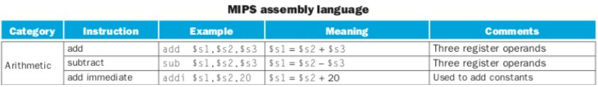

# Arithmetic

## MIPS Arithmetic Instructions
덧셈, 뺄셈, 곱셈, 나눗셈 등의 산술 논리 연산 명령어들
- add
    |op|rs|rt|rd|shamt|funct|
    |--|--|--|--|--|--|
    |6 bits|5 bits|5 bits|5 bits|5 bits|6 bits|
    |0|rs|rt|rd|0|0x20|
    `add rd, rs, rt`

- sub
- 3 operands: 1destination, 2 sources
    - operand에는 임의의 변수 이름(메모리 주소의 별명)을 쓸 수 없음
    - 이는 High level Language와의 차이점.
- Arithmetic instruction use only `register operands`

## MIPS Immediate Arithmetic Instructions
- addi

- subi(?!)
    - `there is no 'subi' instruction`.
    - Why? `addi $t0, $t1, -1`와 같이 addi로 구현 가능하기 때문에

## signed $ unsigned
- 음수는  2의 보수 표현(2’s complement representation)로 나타낸다.
- `-2`를 나타내는 과정
    - `+2`를 2진수로 표현한다. -> a
    - `a`의 1의 보수를 만든다. -> b
    - `b`에 1을 더한다. -> c
- `3-2` = `3+(-2)`
- 뺄셈은 덧셈으로 할 수 있다.

### overflow

- 연산의 결과가 32-bit word로 표현이 되지 않는 상황
- add/addi/sub 명령어는 연산 결과 overflow가 되면 exception 발생
    - exception(예외): 프로그램의 정상적인 수행을 방해하는 계획되지 않은 사건

## MIPS Unsigned Arithmetic Instructions
- addu
- subu
- addiu
    - `addiu 명령의 상수 operand는 음수일 수 있다`
    - 연산방식이 unsigned라는 것이지 operand가 무조건 양수라는 의미가 아니다.

