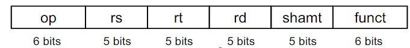

# Rformat

## Instruction fields

|field name| bit | comment | 
|--|--|--|
| op | 6 | operation code |
| rs | 5 | first source register number |
| rt | 5 | second source register number |
| rd | 5 | destination register number |
| shamt | 5 | shift amount|
| funct | 6 | function code(extends opcode) |

|op|rs|rt|rd|shamt|funct|
|--|--|--|--|--|--|
|6 bits|5 bits|5 bits|5 bits|5 bits|6 bits|