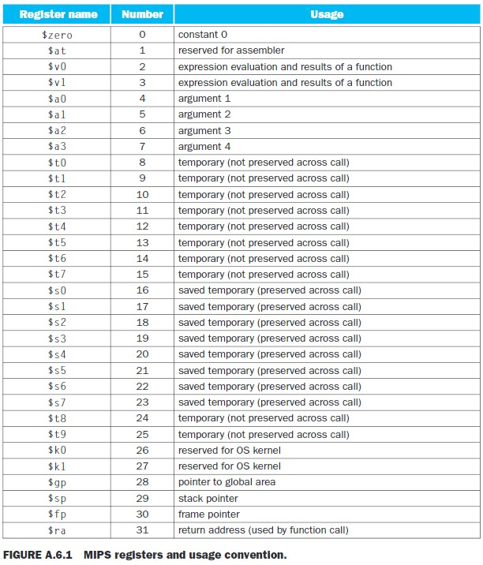

# Register
레지스터: 프로세서 내부에 있는, 작고 빠른 임시의 메모리

## MIPS Register
- 32개의 32bit 크기의 레지스터
- $0 ~ $31
- 32 bit의 data = "word"

## The Constant Zero (0번 레지스터)
- MIPS register 0 (`$zero` or `$0`) 의 값은 항상 0이다.
- 값이 바뀌지 않는다.
    - ex) `add $0, ~~, ~~` -> 등의 명령어는 안된다.

## Register Table
